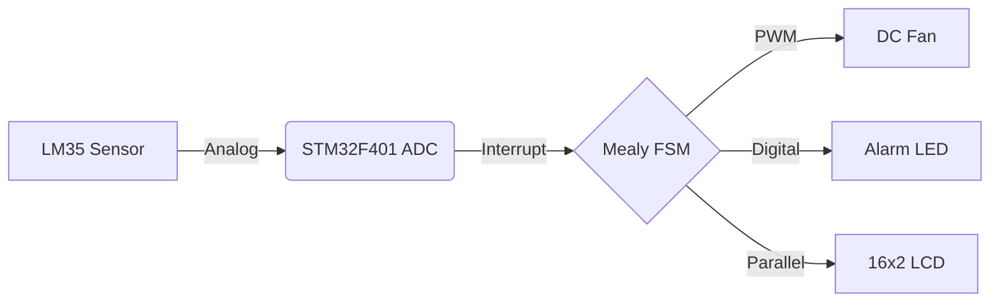

# ❄️ STM32 Auto-Cooler System

<p align="center">
  
  
  
  
</p>

A high-performance, real-time temperature control system implemented on the **STM32F401 (Cortex-M4)**. This project leverages modular bare-metal C drivers and a formal state machine to maintain optimal temperatures using a dynamic cooling fan and visual feedback.

---

## 🚀 Key Features

*   **⚡ Interrupt-Driven Pipeline**: Hardware interrupts (IRQ 18) for End-of-Conversion (EOC) ADC sampling, ensuring zero CPU wastage.
*   **🧠 Intelligent Mealy FSM**: Robust control logic that adapts fan speed based on real-time temperature gradients.
*   **🌪️ Dynamic PWM Cooling**: Variable fan speed control via **TIM3 PWM** (33%, 66%, and 100% duty cycles).
*   **🚨 Safety Alarm**: Visual alarm indicator (LED) and automatic full-speed override for overheat protection ($>40^\circ C$).
*   **🖥️ Real-time UI**: Flicker-free 16x2 LCD interface showing live temperature and fan status.

---

## 🛠 Hardware Architecture

### 📟 Component Mapping
| Icon | Component | Peripheral | Pin | Description |
| :---: | :--- | :--- | :--- | :--- |
| 🌡️ | **LM35 Sensor** | ADC1_IN1 | `PA1` | Linear analog temperature sensor (10mV/°C) |
| 🌀 | **DC Cooling Fan** | TIM3_CH1 | `PB4` | PWM-controlled fan motor |
| 💡 | **Alarm LED** | GPIO Output | `PC0` | High-visibility overheat indicator |
| 📺 | **16x2 LCD** | GPIO | `PD0-7` | UI Display (Data: PD4-7, Ctrl: PD0-2) |
| ⏱️ | **System Tick** | TIM2 | Internal | Precise delay and timing management |

### 🏗 System Diagram


---

## 🧠 Control Logic (State Machine)

The system operates on a predefined temperature gradient to balance power efficiency and cooling performance:

| State | Temperature Range | Fan Speed | Alarm LED |
| :--- | :--- | :--- | :--- |
| **IDLE** | $< 25^\circ C$ | OFF (0%) | ⚪ OFF |
| **COOLING (Low)** | $25^\circ C - 30^\circ C$ | LOW (33%) | ⚪ OFF |
| **COOLING (Med)** | $30^\circ C - 35^\circ C$ | MED (66%) | ⚪ OFF |
| **COOLING (High)** | $35^\circ C - 40^\circ C$ | FULL (100%) | ⚪ OFF |
| **OVERHEAT** | $> 40^\circ C$ | FULL (100%) | 🔴 **ON** |

---

## 📂 Project Structure

```bash
├── main/               # Application logic & Entry point
├── adc/                # ADC Driver (Interrupt-driven)
├── pwm/                # PWM Driver (Timer-based speed control)
├── lcd/                # HD44780 LCD Driver
├── timer/              # System Timer (TIM2) for delays
├── state_machine/      # Mealy FSM implementation
├── nvic/               # Nested Vectored Interrupt Controller config
└── rcc/                # Reset and Clock Control initialization
```

---

## 🔨 Build & Installation

### 📦 Prerequisites
*   `arm-none-eabi-gcc` toolchain
*   `CMake` (version 3.10+)
*   `Make` or `Ninja`

### 🛠 Compilation
1.  **Initialize build directory**:
    ```powershell
    mkdir build
    cd build
    ```
2.  **Configure and compile**:
    ```powershell
    cmake .. -G "MinGW Makefiles"
    make
    ```

---

## 🧪 Simulation
The project includes a **Proteus Design Suite** file (`Project3.pdsprj`) for full system validation. The simulation environment models the LM35 analog response, motor PWM characteristics, and LCD timing accurately.

---

**Team 10 - Embedded Systems Project**  
*Spring 2026 - SBE27 & SBE28*
